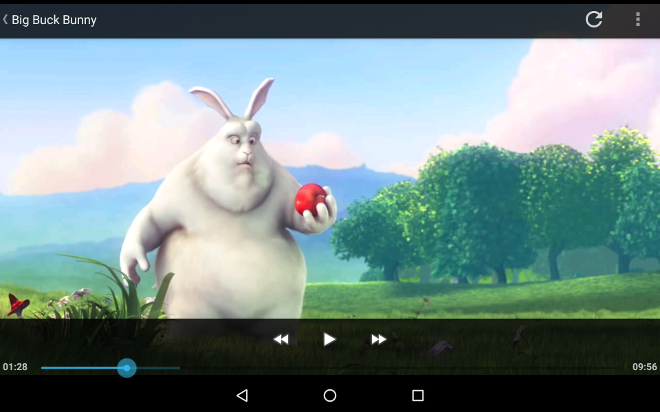
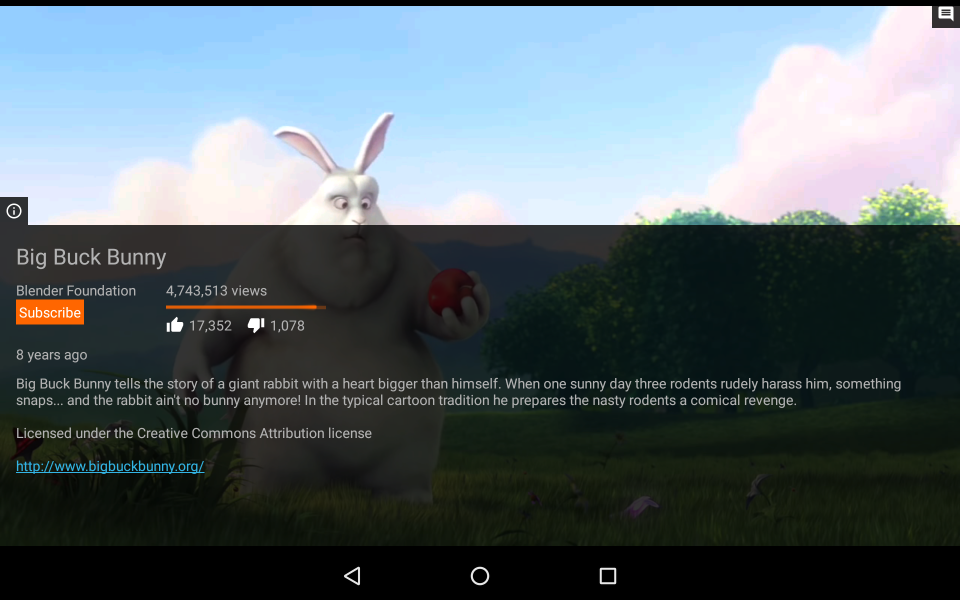
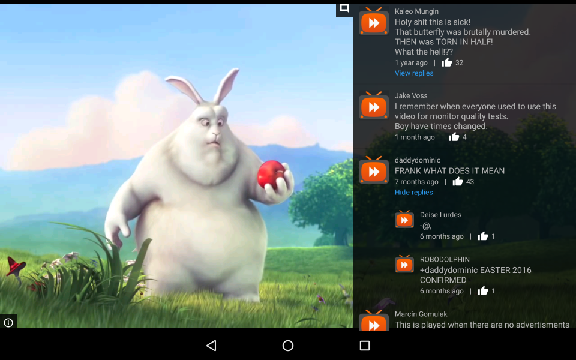
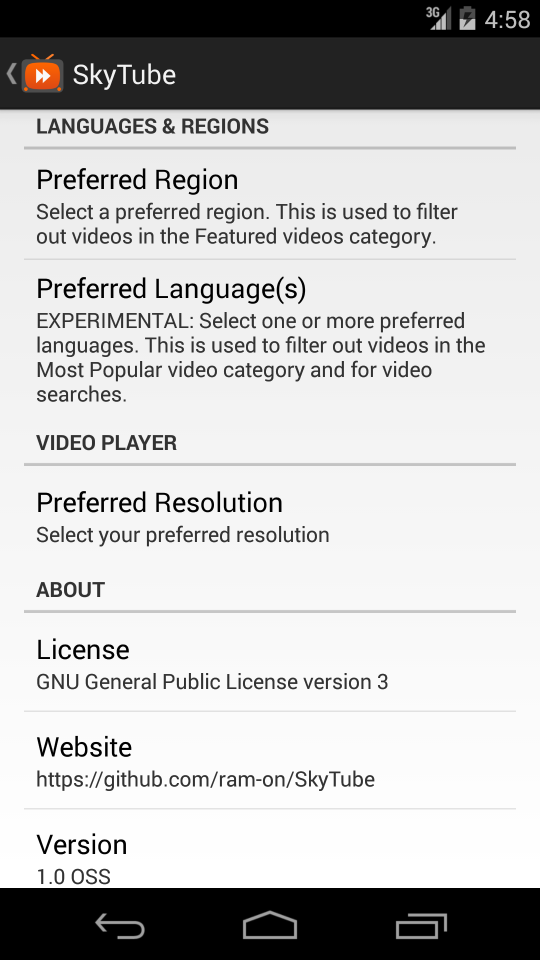

# SkyTube
An open-source YouTube player for Android.

This app allows you to:
* explore Featured and Most Popular videos,
* browse YouTube channels,
* play YouTube videos,
* view video comments,
* search videos, music and channels

... all at the tip of your fingers.

More features will be added in the near future.

## Why SkyTube?
* Innovative design
* No intrusive ads
* Only requires 1 Android-permission (Internet)
* Not dependent on the GAPPS/Google Apps (i.e. YouTube official app)
* No need for Google/YouTube account to operate
* My code does not spy on your behaviour!

## Screenshots

### Tablet

### Mobile Phone

## License
  

This program is free software: you can redistribute it and/or modify
it under the terms of the GNU General Public License as published by
the Free Software Foundation (version 3 of the License).

This program is distributed in the hope that it will be useful,
but WITHOUT ANY WARRANTY; without even the implied warranty of
MERCHANTABILITY or FITNESS FOR A PARTICULAR PURPOSE.  See the
GNU General Public License for more details.

You should have received a copy of the GNU General Public License
along with this program.  If not, see http://www.gnu.org/licenses/
