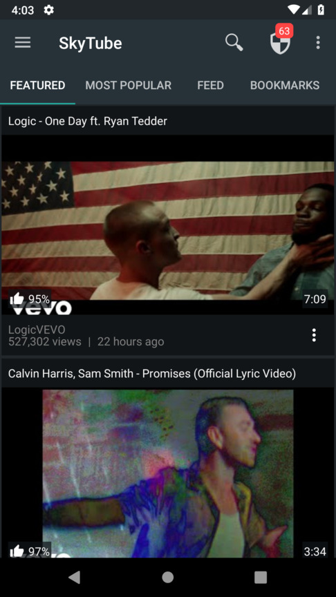
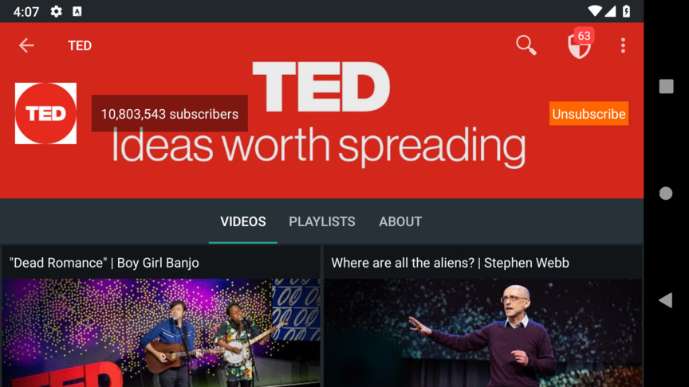
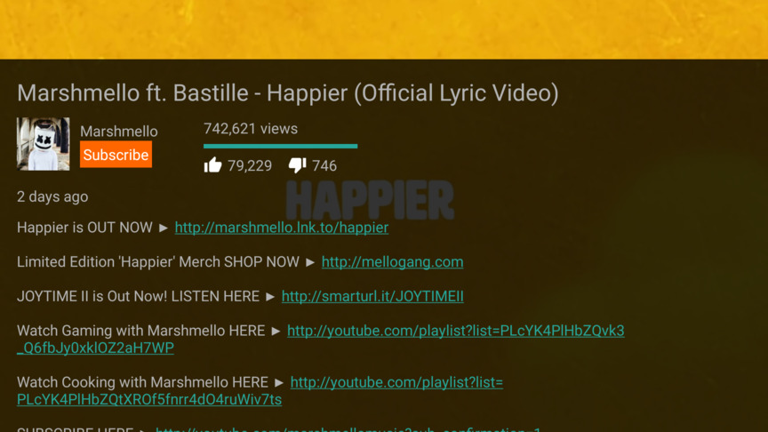
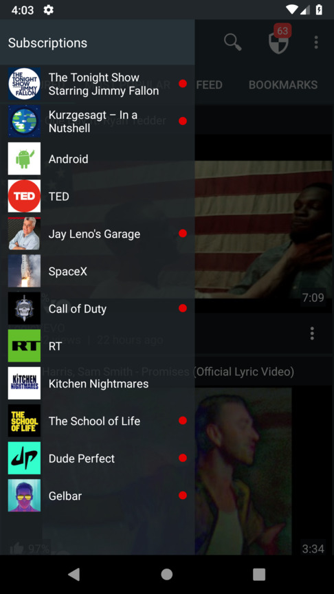
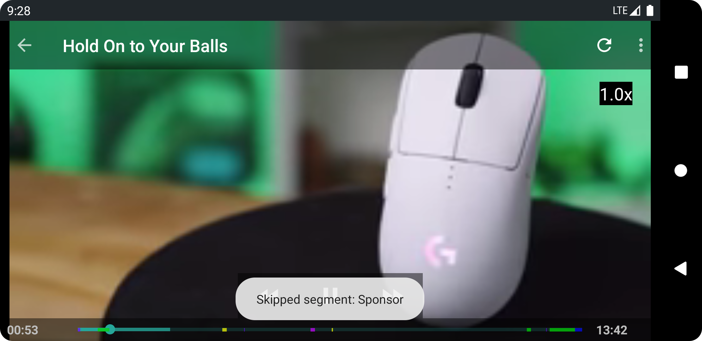
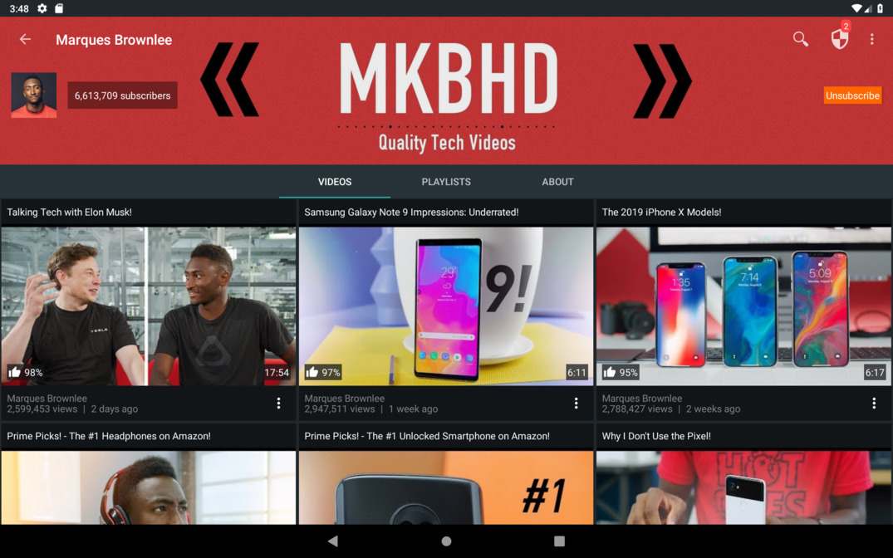

# SkyTube
**A copylefted libre / open source YouTube player for Android, without ads.**

  <a href="#features">Features</a> | 
  <a href="#download">Download</a> | 
  <a href="#why-skytube">Why SkyTube?</a> | 
  <a href="#screenshots">Screenshots</a> | 
  <a href="#contribute">Contribute</a> | 
  <a href="#translate">Translate</a> | 
  <a href="#license">License</a>

## Features
### Innovative Features
* Video blocker featuring:
  - Channel blacklisting
  - Channel whitelisting
  - Block videos if their language is not the same as the user's preferred one(s)
  - Block low-view videos
  - Block high-dislike videos
  - Toolbar icon showing number of blocked videos
* Watched or partially watched videos are marked accordingly. "Resume playing" feature also implemented
* Video swipe controls, including controls for volume, brightness, comments and video description
* Bookmark videos
* Import subscriptions from YouTube
* Play channels' playlists
* Download videos
* Ability to play the video faster — or slower than live. **[New!]**
* View and download video thumbnails
* No adverts when browsing or playing videos
* SponsorBlock to skip advertisement segments
* Back up and restore bookmarks and subscriptions (all stored locally on your device)

### Traditional Features
* Explore Featured and Most Popular videos
* Browse YouTube channels
* Play YouTube videos
* View video comments
* Search videos, music and channels
* Channel subscription & non-intrusive notifications
* Subscriptions feed

More features will be added in the near future.

## Requirements
Android 4.4 (KitKat) or later. For techies, that means an API level of 19 or greater.
If you have older Android device - however, at least 4.0, you should try [SkyTube Legacy](https://github.com/SkyTubeTeam/SkyTubeLegacy/).

## Download
| Feature          | SkyTube Extra                      | SkyTube  |
| ---------------- |------------------------------------| ---------|
| Description      | Contains extra features that are powered by non-OSS libraries. | Fully open-source and free software. |
| GPLv3 license                    | ✅                   | ✅       |
| Official YouTube player support* | ✅                   | ❌       |
| Chromecast Support*              | ✅                   | ❌       |
| Updates availability             | Immediate            | Normally up to 5 days |
| Download APK                     |  | 

_* powered by a closed-source, third-party library._

## Why SkyTube?
* Copylefted libre software
* Gratis
* Innovative design
* No ads
* Multilingual
* Not dependent on GApps/Google Apps (the official YouTube app)
* No need for Google/YouTube account to operate
* Does not spy on your behaviour!

## Translate
You can help us translate this app into your native language by visiting [SkyTube's Weblate page](https://hosted.weblate.org/engage/skytube/). Just log in using your GitHub/GitLab/BitBucket/Google/Facebook account and start translating!

### Translation status:

## Screenshots
### Phone

### Tablet

## Contribute
This project was possible with the support and contribution of [numerous volunteers and third-party projects](http://skytube-app.com/credits.html).

Help improve SkyTube by [translating](https://github.com/SkyTubeTeam/SkyTube/wiki/Contribute#translate) or [developing](https://github.com/SkyTubeTeam/SkyTube/wiki/Contribute#developers-guidelines) it.

## License

This project is not affiliated with YouTube™ or any of its partners and/or products.
YouTube™ and Android™ are registered trademarks of Google Inc.

## Star History

